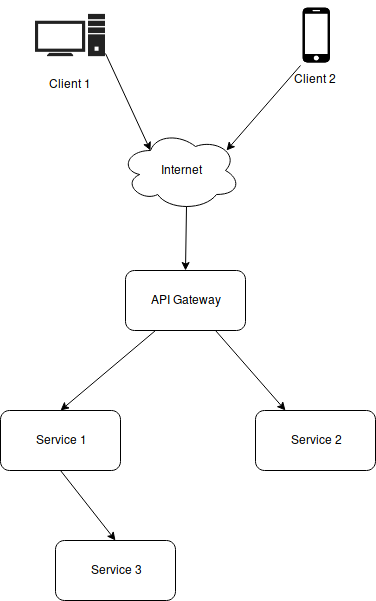

# tracing

[](https://goreportcard.com/report/github.com/gin-contrib/opengintracing)
[](https://godoc.org/github.com/gin-contrib/opengintracing)
[](https://opensource.org/licenses/MIT)

trace requests using opentracing specification, Download:

```bash
go get -u github.com/gin-contrib/opengintracing
```

See [opentracing/opentracing-go](https://github.com/opentracing/opentracing-go) for more information.

## Usage

For example you have architecture like this



To start requests tracing you have to:

* On "API Gateway": start span, inject headers and pass it to services

```go
package main
import (
    ...
    "github.com/gin-gonic/gin"
    "github.com/gin-contrib/opengintracing"
    "github.com/opentracing/opentracing-go"
    ...
)

var trace = /* setup tracer */

func main() {
    ...
    app := gin.Default()

    app.POST("/service1",
        opengintracing.NewSpan(trace, "forward to service 1"),
        opengintracing.InjectToHeaders(trace, true),
        service1handler)
    app.POST("/service2",
        opengintracing.NewSpan(trace, "forward to service 2"),
        opengintracing.InjectToHeaders(trace, true),
        service2handler)
    ...
}
```

* On "Service 1", "Service 2" start span inherited from "API Gateway"`s span

```go
package main
import (
    ...
    "github.com/gin-gonic/gin"
    "github.com/gin-contrib/opengintracing"
    "github.com/opentracing/opentracing-go"
    ...
)

var trace = /* setup tracer */

func main() {
    ...
    refFunc := opentracing.FollowsFrom
    app := gin.Default()

    app.POST("",
        opengintracing.SpanFromHeaders(trace, "operation", refFunc, true),
        // don`t forget to inject if you want continue tracing in other service
        opengintracing.InjectToHeaders(trace, true),
        handler)
    ...
}
```

Also don`t forget to forward headers from "Service 1" to "Service 3"

* On "Service 3" injecting to headers is not required

```go
package main
import (
    ...
    "github.com/gin-gonic/gin"
    "github.com/gin-contrib/opengintracing"
    "github.com/opentracing/opentracing-go"
    ...
)

var trace = /* setup tracer */

func main() {
    ...
    refFunc := opentracing.ChildOf
    app := gin.Default()

    app.POST("",
        opengintracing.SpanFromHeaders(trace, "operation", refFunc, true),
        handler)
    ...
}
```

## TODO

* [x] add code sample
* [ ] maybe add sample with SpanFromContext
* [ ] add buildable example (needed simple logging tracer)
